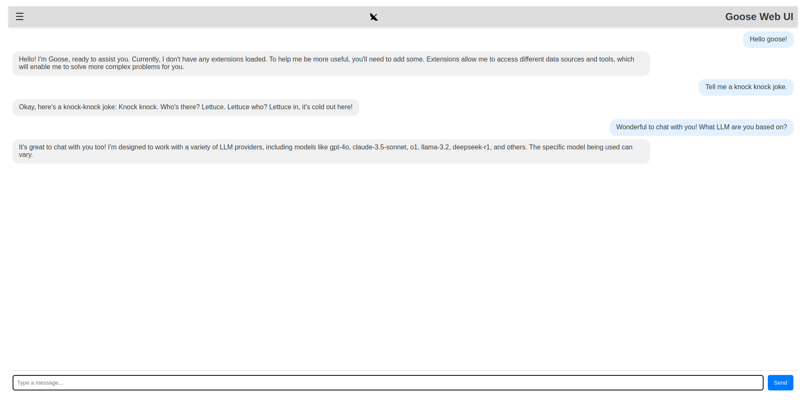

# Goose Web UI



This directory contains the source code for the web-based user interface for Goose. It's built using React and provides a user-friendly way to interact with the Goose agent.

## Overview

The Web UI allows you to:

- Send messages to the Goose agent and view its responses in a chat-like interface.
- Configure settings such as API keys and themes.
- Monitor the agent's initialization status.

## Key Components

- `src/App.js`: The main application component that sets up the routing and overall layout.
- `src/components/Header.js`:  Displays the application header with a toggle button for the sidebar.
- `src/components/Sidebar.js`:  A navigation sidebar for switching between different views (Chat and Settings).
- `src/components/ChatView.js`:  The main chat interface where you can send messages and view the conversation history.
- `src/components/SettingsView.js`:  A form for configuring various settings.
- `src/components/ChatMessage.js`: Displays individual chat messages.
- `src/AgentInitializer.js`: Handles the initialization of the Goose agent upon loading the application.
- `src/api.js`: Contains functions for making API calls to the Goose backend.
- `src/App.css`: Contains the CSS styles for the application.

## Running the Web UI

1.  **Navigate to the `webui` directory:**

    ```bash
    cd webui
    ```

2.  **Install dependencies:**

    ```bash
    npm install
    ```

3.  **Start the development server:**

    ```bash
    npm start
    ```

    This will typically start the application at `http://localhost:3001`.  Note that the port is explicitly set in the `start` script within `package.json`.

## Interacting with the Goose Agent

-   **Chat View:**  Once the agent is initialized (as indicated by the "Initializing agent..." message disappearing), you can type messages in the input field and press "Send" or hit "Enter" to send them to the Goose agent. The agent's responses will appear in the chat container.
-   **Settings View:**  Navigate to the "Settings" view using the sidebar to configure API keys, themes, and other options.  Note that the current implementation of the settings view is a placeholder and doesn't yet persist settings.

## Notes

-   The Web UI relies on a running Goose backend to function correctly. Ensure that the backend is running and accessible at the configured `API_BASE_URL` (currently `http://localhost:3000`) in `src/api.js`.
-   The `SECRET_KEY` in `src/api.js` must match the secret key configured in the Goose backend.
-   The `AgentInitializer` component automatically attempts to initialize the agent with a default provider and model. You may need to modify this component to use your desired provider and model selection logic.
